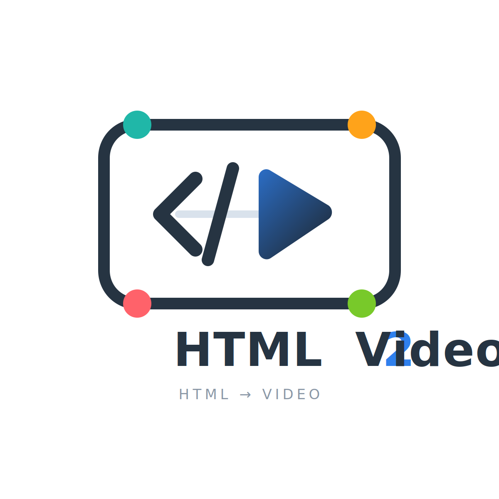

# HTML edge-tts Video



---

Create narrated presentation-style videos from two authored files:

```text
.local/work/my-video/
  scenes.json
  body.html
  media/ optional
```

`scenes.json` owns scene order, chapter labels, and narration. `body.html` owns every visible title,
layout, color, diagram, chart, and optional deterministic visual module. The stable shell owns TTS
timing, captions, playback, chapter progress, scene transitions, and MP4 rendering.

## Install

```bash
python main.py install
```

This installs Python dependencies, `imageio-ffmpeg`, and only Playwright's Chromium Headless Shell.
The pipeline never uses a system browser or system FFmpeg.

## Try the starter

The tracked starter is a read-only example. Copy it into a project folder before making changes:

```bash
python main.py init --target .local/work/my-video
python main.py offline --source .local/work/my-video
python main.py check
python main.py studio --source .local/work/my-video
python main.py render --output my-video.mp4
```

Use `tts` instead of `offline` when network TTS is available:

```bash
python main.py tts --source .local/work/my-video
python main.py render --output my-video.mp4
```

## Source format

```json
[
  {
    "id": "intro",
    "category": "总览",
    "narration": "先介绍视频将说明什么。"
  }
]
```

The first id must be `intro`. Categories are at most 12 characters. Add a matching section and all
project CSS to `body.html`:

```html
<!DOCTYPE html>
<html>
  <head>
    <meta charset="utf-8" />
    <meta name="viewport" content="width=device-width, initial-scale=1" />
    <title>Presentation video</title>
    <style>
      .slide {
        position: absolute;
        inset: 0;
        padding: 8vh 7vw 22vh;
      }
    </style>
  </head>
  <body>
    <section class="content-scene slide" data-scene="intro">
      <h1>标题</h1>
    </section>
  </body>
</html>
```

Do not hard-code `active` or `is-active` on a scene. The shell selects exactly one scene from the
timeline and owns scene visibility. Scope source CSS to `#stage` and scene elements; global `html`
or `body` rules can interfere with the shell and are not supported.

Do not add playback controls, captions, footers, timecodes, chapter rails, or scene transitions.
Prefer HTML/CSS/SVG. An advanced visual may use one inline module exporting deterministic `mount()`
and `renderAtTime()` functions; see `docs/agent-skill.md`.

## Generate an AI prompt

```bash
python main.py prompt --topic "介绍一个新产品" --language zh-CN --target agent
python main.py prompt --topic "Explain event loops" --language en-US --target web-ai
```

The single template is `docs/source-prompt.md`. It keeps the visual language consistently bright,
editorial, and blue-green while allowing the AI to choose a fitting composition for each subject.

## Normal loop

```bash
python main.py tts --source .local/work/<project-slug>
python main.py check
python main.py studio --source .local/work/<project-slug>
python main.py render --output video.mp4
```

Use `python main.py captions` to edit on-screen subtitle text after TTS. Generated state lives under
`.local/`; Studio-managed projects keep generated audio and output beside their two source files.
The only tracked exception is `.local/work/starter/body.html` and `scenes.json`; every other file
under `.local/` is runtime state. Never author a video in `starter`; each video belongs in its own
`.local/work/<project-slug>/` folder.

Transitions default to a deterministic 0.4-second dip to the shell background. Set
`--transition 0.3`, or use `--transition 0` to disable them.

## Architecture

```text
scenes.json + body.html
  -> load_source()
  -> .local/current/source/
  -> edge-tts or offline timeline
  -> .local/current/assets/
  -> pipeline/shell/runtime.js
  -> Playwright Chromium Headless Shell
  -> imageio-ffmpeg
  -> MP4
```

The authored source owns content and presentation styling. The stable shell owns captions, chapter
progress, playback, timing, and transitions. Generated audio and timelines are caches rather than
source. Studio adds project metadata and editing UI without changing the two-file contract.

### Source loading and validation

`pipeline/factory.py` accepts `scenes.json`, `body.html`, optional `media/`, and optional
`captions.json`. It copies the normalized source into `.local/current/source/` and records the source
path, resolved language, and load time.

`pipeline/validate_sources.py` checks scene ids, the `intro` first scene, short categories,
narration, matching `[data-scene]` sections, embedded CSS, and the absence of transport UI. Source
may contain at most one inline module script. It must export `mount()` and `renderAtTime()`, avoid an
independent animation loop, and pin Three.js versions.

Sidecar `body.css`, `visual.js`, nested `content/`, and `index.html` compatibility paths are not
supported.

### Prompt, timeline, and rendering

`pipeline/prompt_composer.py` fills `docs/source-prompt.md` with the requested content parameters.
Agents write the two files directly; web AI returns two fenced code blocks. The prompt keeps a
consistent bright blue-green editorial palette while allowing scene composition to follow the topic.

`pipeline/build_tts.py` synthesizes scenes, captures WordBoundary metadata, inserts scene gaps, and
concatenates narration using managed FFmpeg. `pipeline/build_offline_preview.py` produces the same
timeline shape with estimated durations and silent audio.

`pipeline/shell/runtime.js` loads source, activates scenes by absolute time, applies captions,
updates chapter progress, and calculates transitions. It exposes:

```js
window.compositionReady;
window.getCompositionDuration();
window.renderAtTime(seconds);
window.getPlaybackState();
window.togglePlayback();
window.startCompositionPlayback();
```

`pipeline/render_video.py` captures with Python Playwright's managed Chromium Headless Shell and
muxes with the FFmpeg binary returned by `imageio-ffmpeg`. It never uses a system browser or FFmpeg
from `PATH`.

### Studio

Studio creates, imports, deletes, validates, plays, narrates, and renders projects. “New project”
first offers AI creation or result import; neither path creates a folder until “Save and load” is
used in the import dialog. Prompt creation and source import open as dialogs without leaving the
workspace. A project manifest
stores identity, display name, language, and TTS settings. Presentation style and rendering engine
remain properties of `body.html`. Studio discovers projects under `.local/work/`; the built-in
`starter` project lives there too and is read-only in Studio.
